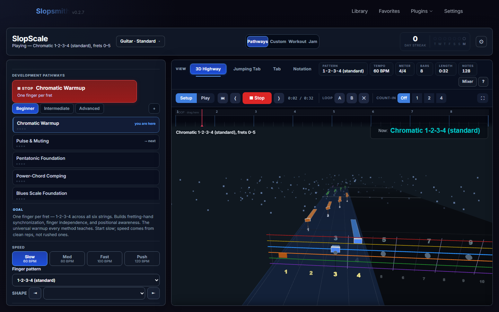
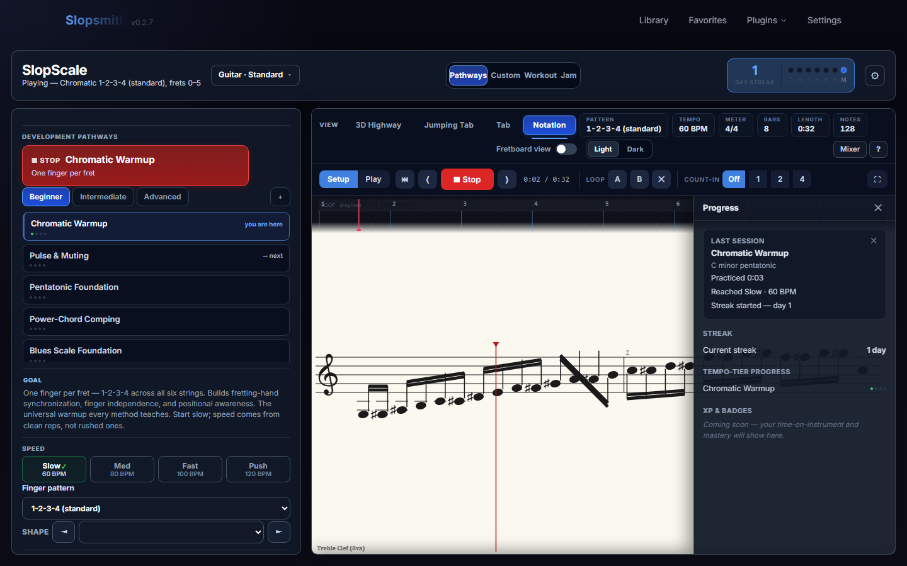

# SlopScale

A Slopsmith plugin that turns scales, arpeggios, technique, and grooves into **practice routines you actually want to run** — and plays them back in its own DAW-style player with a real-sounding backing band.

**Most practice apps teach you _songs_. SlopScale teaches you the _skills_** — the gallop, the ii–V–I, the one-drop — so what you build here you take off the screen into your own playing. Pick a pathway, set a tempo, hit Play, and drill.

> **Practice the skill, not the song.** SlopScale is a practice & learning tool, not a song/riff generator — generated routines exist to teach a move, then get out of your way.

Install drops it into Slopsmith and it shows up in the nav as **SlopScale**: pick a pathway, hit Play, and you're drilling in under a minute.

<p align="center">
  
  <br><sub><i>The DAW-style shell — pick a pathway, set a tempo, and drill on the 3D Note Highway (or Tab / Notation).</i></sub>
</p>

## Why SlopScale

- **No song to unlock — drill the exact thing you're stuck on.** It generates the scale, arpeggio, or lick at any position, key, and tempo. No library, no waiting for the right tab.
- **A backing band that doesn't sound like MIDI.** Sampled comp, bass, and drums voiced to the chord — real feel to play *to*, not a metronome with chords.
- **Skills that transfer.** Every routine names the move it teaches, so you leave with vocabulary you own — not muscle memory for one song.
- **DAW-grade control, no subscription.** Loop, slow down, mix, retune — the controls a practising player actually wants. Rides your Slopsmith install; no separate sign-up.

## What it is

One **DAW-style shell with four modes**, all sharing the same player, ruler/transport, mixer, and render stage — no second window, nothing to relearn between modes:

- **Pathways** — curated, sequenced routines that build a skill from the ground up (the picker groups them into bands from beginner foundations to advanced/idiom packs).
- **Custom** — full manual control: pick the exact scale, shape, position, meter, progression, and feel you want to drill. Any Custom setup can be saved as a preset or dropped into a Workout.
- **Workout** — a timed, multi-block practice session ("woodshed N minutes"): warm up, target a weak skill, then apply it — built from the same pathway/Custom units, run back-to-back on a wall clock.
- **Jam** — pick a style, hit one button, and play along immediately over a looping backing band. **Jam is a mirror, not a judge** — no score, no rank; instead the live fretboard strip lights up the current chord's tones / guide tones so the jam *teaches* you what to reach for.

## Highlights

- **Jam is a mirror, not a judge** — play along over a live backing band while the fretboard strip lights up the chord/guide tones to reach for. No score, no rank — a sandbox to *apply* what you drilled, not a track to mimic
- **A real backing band** — sampled comp, bass, and **drums** (kits change by feel & genre), through a safety-limited master so nothing clips or jumps in level
- **Drum kits that change by feel & genre** — procedural **808 / 909** for electronic feels and **sampled acoustic kits** for everything else, on grooves that follow the meter — including **odd meters** (7/8, 5/4, …) via a grouping-aware groove
- **27 curated pathways** across foundations, technique, jazz/blues vocabulary, modal work, and sweep arpeggios — plus a **metal/djent pack** (pedal chug, gallop, twin leads, polymeter, chromatic riffing)
- **A live Mixer (`M`)** — swap the comp to organ, the drums to a 909, dim the backing, all while you play
- **Four render surfaces** — 3D Note Highway, 2D Highway, paper-style Tab, and staff Notation — one chart, your choice, with Light/Dark themes
- **Extended-range & drop tunings** — 6/7/8-string guitar and 4/5/6-string bass, standard / drop / open / fully custom per-string
- **The practice-room basics** — count-in, A/B looping, share links, saved presets & tunings, on-screen hotkeys (`M`/`P`/`[`/`?`), and a calm progress readout (streak calendar + last-session card; never a gate)

## Renderers

| Renderer | What it looks like |
|---|---|
| **3D Note Highway** | Slopsmith's bundled 3D fretboard view (the default for guitar **and** bass), loaded on demand and inheriting the host's highway look settings |
| **2D Highway** | Borrowed "Jumping Tab" view — string-coloured note tiles, sustain bars, accent halos, technique glyphs, beat lines, measure numbers, chord tiles, section markers |
| **Tab** | Paper-style guitar tab — parchment ground, fret numbers on the strings, italic chord names, red playhead; dark mode swaps to a navy ground |
| **Notation** | Standard staff notation (treble / 8va / bass clef), key signature, beams, accidentals — same parchment-and-ink design language; dark mode available |

<p align="center">
  
  &nbsp;
  
  <br><sub><i>One chart, your choice of surface: paper-style Tab and standard Notation (3D Highway shown above).</i></sub>
</p>

A docked **live fretboard strip** sits under the Tab and Notation views (toggleable), drawing the exercise's whole shape and glowing the notes as they sound. The Light/Dark toggle appears when Tab or Notation is active and persists across reloads.

## Audio

Playback is fully contained in the plugin (its own clock, Web Audio graph, and pitch tracker). The signal path is **per-track buses → a master safety limiter → output**, so stacked notes stay clean and normalised — no clipping, no surprise full-volume hits.

- **Practice voice** — sampled, at the actual string/fret pitches; the oscillator voice is the fallback so you're never left silent on a cold load
- **Backing band** — sampled comp + bass voiced per progression step (key-aware voicing engine), plus the new drum voice
- **Drums** — a `drums` bus with its own compressor (before the master); kits are chosen per style/feel and pieces are humanised so it doesn't read as a drum machine. Drums stay silent through the count-in and enter on the downbeat
- **Metronome** — accent on beat 1, group accents that follow the meter's grouping (3+2+2 vs 2+2+3 for 7/8, etc.)
- **Per-style sound** — an audio-profile system maps a genre to a tone/brightness, overridable from the Mixer

## Configuration

Dial in anything — 12 keys, 25+ scales, any tuning, any meter, any feel — or let a pathway set it all for you. The full menus:

### Key & scale
12 keys; 25+ scale families: major, natural / harmonic / melodic minor, the seven modes of major, the melodic-minor modes (Dorian ♭2, Lydian augmented, Lydian dominant, Mixolydian ♭6, Locrian ♮2, altered), minor & major pentatonic, blues, bebop major & dominant, whole-tone, diminished, Phrygian dominant, plus exotic colours (double harmonic, Hungarian minor, Neapolitan minor) for the metal/idiom work.

### Instruments & tuning
- **Guitar** — 6 / 7 / 8 strings: Standard, Drop D, Eb / D Standard, DADGAD, Open G/D, Drop A (7), Drop E (8)
- **Bass** — 4 / 5 / 6 strings: Standard, Drop D, Eb, BEAD, high-C tenor, Drop A. Bass uses a single movable position box (CAGED/3NPS are guitar artifacts and are hidden on bass — by design)
- **Custom tuning** — per-string note inputs (`E2`, `F#3`, `Bb4`…); **+ Save tuning…** persists it under a name in the host DB
- **Piano** — UI scaffolded; keyboard generators are a future phase

### Tempo, meter & feel
30–260 BPM · 4/4, 3/4, 6/8, 7/8 (2+2+3 or 3+2+2), 5/4 · quarter / eighth / sixteenth / triplet subdivisions · straight / swing / shuffle feel · count-in None / 1 / 2 / 4 bars.

### Practice types
Scale patterns · chord-scales (mode-of-the-moment or chord-tone emphasis) · diatonic arpeggios · progression arpeggios · sweep arpeggios (HOPO turnaround) · chromatic warmups · guide tones · and a deep **technique/vocabulary** library (legato, bends, vibrato, scale in 3rds/6ths, call-and-response, tremolo, tapping, pedal point, string skipping, position shifts, rhythmic displacement, chromatic enclosures, bebop scale, arpeggio inversions, walking bass, hybrid picking, triadic pairs, pentatonic superimposition, shell voicings, octave displacement, and the metal pedal-riff / gallop / twin-lead primitives).

### Fretboard systems
CAGED position (auto fret-window per key + shape) · CAGED single-shape (strict-ascend or closest-position) · 3-notes-per-string (seven modal positions) · open position · manual position box · single-string run · full-neck map. Shapes are **degree-driven** with a no-unison guarantee — a run never sounds the same pitch twice across strings.

### Harmony engine
Diatonic progressions, the common pop/jazz/blues sets, minor ii–V–i, 12-bar & quick-change blues, and a **jazz harmony engine**: chord depth (power / triad / seventh / 9·11·13 / 6 / m6 / 6-9 / sus / m(maj7)), auto-diatonic stacking with correct altered tensions, **tritone substitution**, and a voicing engine that turns a full interval stack into a *playable, musical* voicing rather than stacking every formula note.

## Persistence
- **Save preset** — full config to the host SQLite DB (`slopscale_presets`)
- **Save tuning** — custom tunings to `slopscale_tunings`, shown under "Saved" every session
- **Share link** — the whole form state encodes into a URL hash; paste a link to land on the exact same exercise

## Quick start

### Prerequisites
- A working Slopsmith install (web/Docker or Desktop)
- Write access to Slopsmith's `plugins/` directory

### Install (Slopsmith web/Docker)
```bash
cd /path/to/slopsmith/plugins
git clone https://github.com/ChrisBeWithYou/slopsmith-plugin-slopscale.git slopscale
docker compose restart
```

### Install (Slopsmith Desktop)
Clone into the Desktop app's configured plugins directory (visible in **Settings → Plugins**).

> **Note:** Don't clone directly under `C:\Program Files\Slopsmith` — Windows protects that path. Use the user-writable plugins directory the Desktop app reports in Settings.

After restart, **SlopScale** appears in the plugin navigation.

### First five minutes
Open **SlopScale → Pathways**, pick a beginner node (e.g. *Pentatonic Foundation*), and hit **Play** — you're drilling. Then switch to **Jam**: pick a style, press play, and noodle over the band while the fretboard strip shows you the notes to land on. That's the whole loop — drill a skill, then go use it.

## File layout

| File | Purpose |
|------|---------|
| `plugin.json` | Slopsmith plugin manifest |
| `screen.html` | Plugin UI (markup + inline styles + bootstrap) |
| `screen.js` | Generators, pathways, renderers, audio engine, mixer, and host integration |
| `routes.py` | DB-backed preset + tuning persistence; self-hosted audio asset routes |
| `settings.html` | Plugin settings / info panel |
| `static/` | Self-hosted audio assets (`wafonts/` sampler + drum kits) served by `routes.py` |
| `docs/` | Architecture, exercise schema, pedagogy, theory knowledge base, and design notes |

## Roadmap

- Deeper drum realism (per-genre grooves + humanisation) and a brush/percussion kit set
- A unified progress store (XP-as-readout, Off / Casual / Hardcore — soft, never gating)
- A comping generator (CAGED triads / 7ths on a strum grid) for the open-chord Core nodes
- Per-instrument Development Pathways (guitar Core shipped; bass & piano to follow)
- Live amp-modelled distorted backing (host NAM-engine borrow, in progress)
- Piano / keyboard exercise generation
